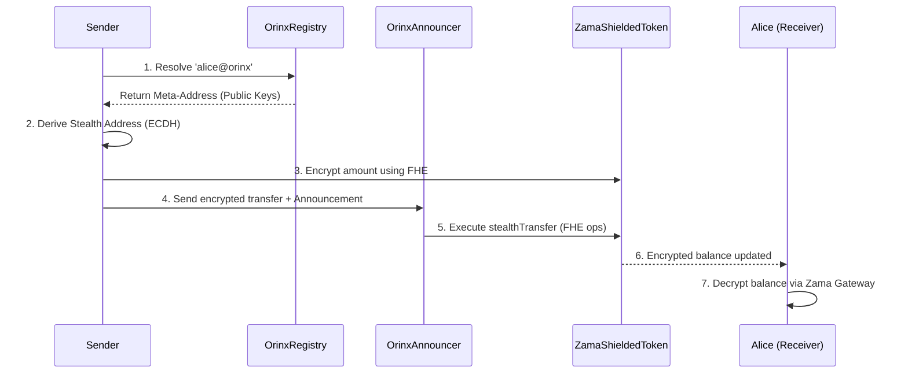
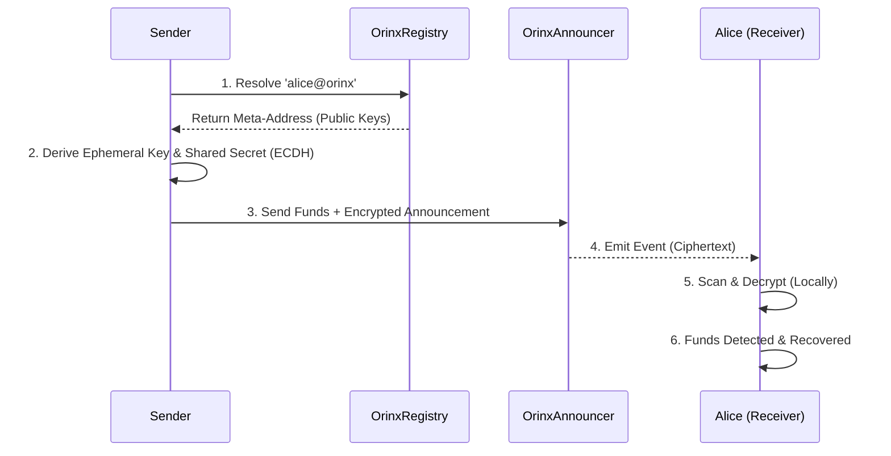

# Orinx on Zama fhEVM 🔒

### The Privacy Layer for Ethereum with Fully Homomorphic Encryption
**Orinx** brings **end-to-end encrypted stealth payments** to Ethereum Sepolia using Zama's fhEVM, allowing users to receive, hold, and send funds with **encrypted balances** and **unlinkable addresses**.

## 🔐 Orinx at a Glance

- **Fully Homomorphic Encryption (FHE)**: Balances and amounts remain encrypted on-chain—validators compute on ciphertext without decrypting.
- **Stealth Addresses**: One-time use addresses ensure sender-receiver unlinkability.
- **Zero-Trust Architecture**: Privacy guarantees remain intact even if the blockchain, frontend, or all external infrastructure are fully observable.
- **Client-Side Privacy**: All sensitive cryptography and key derivation happens locally.
- **Non-Custodial**: Keys never leave the user's device.
- **Recoverable**: Funds can always be recovered directly from the chain without Orinx UI.

<div align="center">
  
  
  
  
</div>

<div align="center">
  
  
  
  
  
</div>

## ⚡ TL;DR
Orinx brings **Institutional Privacy** to Ethereum using Zama's fhEVM. We combine **Fully Homomorphic Encryption** (encrypted balances) with **Stealth Addresses** (unlinkable identities) for maximum on-chain privacy. Stay **non-custodial**, avoid mixers, and keep enterprise transactions **confidential**.

> **"Privacy is not about hiding bad things. It's about protecting good people."**

## 🚫 The Problem: The Glass House

Blockchains are **architectures of surveillance**.

By default, every transaction you make—payments, salary, medical bills, donations—is broadcast to the world forever. **Standard wallets don't just leak your data**; they **dox** your entire financial life to:
*   **Ad Tech**: Building profiles of your net worth and spending habits.
*   **Bad Actors**: Targeting you for phishing or extortion based on your balance.
*   **Competitors**: Monitoring your business's cash flow and supply chain.

**Even worse**: Your account balance is fully visible to anyone with your address. A simple mistake of sharing your address for one payment exposes your entire financial history.

**Real finance requires confidentiality.** Orinx bridges the gap between transparent chains and the privacy we need.

---

## 🕶️ The Solution: FHE + Stealth Addresses

Orinx is an **on-chain privacy protocol** that brings **Fully Homomorphic Encryption** and **Stealth Addresses** to Ethereum.

### What Zama fhEVM Adds

Traditional stealth address protocols still reveal transaction **amounts** on-chain. With Zama's fhEVM:

1.  **Encrypted Balances**: Your token balance is encrypted (`euint64`)—even the contract owner cannot see it.
2.  **Homomorphic Transfers**: When you send tokens, the contract performs math on **encrypted values**—validators never see the amount.
3.  **Stealth + FHE**: Combine stealth addresses (unlinkable recipients) with encrypted amounts (hidden values) for **complete payment privacy**.

### How It Works



---

## 🔥 Key Features

### 1. Fully Homomorphic Encryption (FHE) 🔐
Your balance is encrypted on-chain using Zama's `euint64` type.

*   **Encrypted Balances**: `_encryptedBalances[address]` stores `euint64` ciphertext, not plaintext.
*   **Homomorphic Operations**: Transfers use `FHE.add()` and `FHE.sub()` on encrypted values.
*   **Controlled Decryption**: Only the balance owner can decrypt via the Zama Gateway.

### 2. Stealth Addresses 🕶️
We decouple your **Public Identity** from your **On-Chain Assets**.

*   **Public Identity**: You share a single, static ID (e.g., `alice@orinx`).
*   **Private Settlement**: When Bob pays you, the protocol derives a **unique, unlinked address** just for that payment.
*   **Unified Dashboard**: Orinx aggregates all stealth addresses into a single encrypted view.

### 3. Fortress-Level Security 🏰
Orinx acts like a Hardware Wallet inside your browser.

*   **Isolated Execution**: All sensitive cryptography happens locally.
*   **Zero Leakage**: Your private keys **NEVER** leave your device.
*   **"Scorched Earth" Policy**: If you close the tab, the keys are wiped from memory instantly.

### 4. Smart 2FA (Identity Binding) 🔐
We bind your wallet keys to a **PIN/Password** using high-hardness cryptography.

*   **The Result**: Even if an attacker steals your 12-word phrase, **they cannot access your Orinx funds** without your 2FA PIN/Password.
*   **Cryptographic Second Factor**: Your stealth addresses cannot be derived without your PIN.

---

## 🚀 Why Zama fhEVM?

Orinx + Zama fhEVM is the perfect combination for **confidential DeFi**.

### 1. Encrypted Balances 🔒
Unlike standard ERC-20 tokens where balances are public, `ZamaShieldedToken` keeps balances encrypted. This enables:
*   **Private payroll**: Pay employees without revealing salaries to the world.
*   **Confidential treasuries**: DAOs can hold funds without exposing holdings to competitors.
*   **Stealth DeFi**: Build lending, AMMs, and other DeFi primitives with encrypted state.

### 2. Compliant Privacy ⚖️
Zama's fhEVM supports **controlled decryption** via the Zama Gateway:
*   **Auditable**: Users can decrypt and prove balances for tax/compliance.
*   **Non-Custodial**: We never hold your funds or decryption keys.
*   **Regulator-friendly**: Privacy with the ability to disclose when required.

### 3. Ethereum Compatible 🌐
Built on Ethereum Sepolia—mainnet-ready architecture:
*   **Standard ERC-20 Interface**: Deposit any ERC-20 token to get encrypted balances.
*   **EVM Compatible**: Works with MetaMask, WalletConnect, and existing wallets.
*   **Future-proof**: Zama fhEVM is coming to Ethereum mainnet.

---

## 🎯 Zama Track Focus

Orinx is built to showcase the power of **Fully Homomorphic Encryption** for real-world privacy use cases.

### 1. Encrypted Token Transfers 🔐
**ZamaShieldedToken.sol** wraps any ERC-20 with FHE encryption:
*   **Shield**: Deposit plaintext tokens → receive encrypted balance.
*   **Stealth Transfer**: Send to a stealth address with encrypted amount.
*   **Unshield**: Withdraw plaintext tokens from encrypted balance.

### 2. Stealth Address Registry 🕶️
**OrinxRegistry.sol** + **OrinxAnnouncer.sol** handle stealth address derivation:
*   **DKSAP**: Double Key Stealth Address Protocol for unlinkable payments.
*   **Encrypted Announcements**: Payment metadata encrypted and emitted as events.
*   **Local Scanning**: Receiver scans events locally to discover their payments.

### 3. Privacy-Preserving UX 📱
We bring "Web2 Usability" to FHE-powered privacy:
*   **Username System**: `alice@orinx` replaces 42-character hex strings.
*   **One-Click Privacy**: Shield → Transfer → Unshield in seamless flow.
*   **Mobile Optimized**: FHE operations offloaded to Zama Gateway for mobile-friendly performance.

---

## 🏗️ Technical Architecture

Orinx is built on a **"Trust Nothing"** architecture.

### 🛡️ Threat Model
Orinx is designed under a zero-trust threat model.
The blockchain and frontend are treated as untrusted, and privacy guarantees must hold even if all infrastructure except the client’s local worker is fully observable.

### The Transaction Lifecycle


### Smart Contract Stack

| Contract | Purpose | Key Features |
|----------|---------|--------------|
| **ZamaShieldedToken** | Encrypted ERC-20 wrapper | `euint64` balances, FHE operations, shield/unshield |
| **OrinxRegistry** | Identity layer | Maps `@username` to stealth meta-address |
| **OrinxAnnouncer** | Payment router | Emits encrypted announcements, executes stealth transfers |

### The FHE Transaction Lifecycle

1.  **Shield**: User deposits USDC → receives encrypted `euint64` balance.
2.  **Derive**: Sender looks up recipient's meta-address from registry.
3.  **Encrypt**: Sender generates ephemeral key and encrypts transfer amount using FHE.
4.  **Announce**: Sender calls `Announcer` with stealth address + encrypted amount.
5.  **Execute**: `ZamaShieldedToken` performs homomorphic subtraction (sender) and addition (receiver).
6.  **Decrypt**: Receiver uses Zama Gateway to decrypt their new balance off-chain.

### The Stack
*   **Frontend**: React, TypeScript, Zama fhevmjs for client-side encryption.
*   **Cryptography**: `@noble/secp256k1` (stealth), `fhevmjs` (FHE encryption).
*   **Contracts**: Solidity ^0.8.24, `@fhevm/solidity` library.
*   **Network**: Ethereum Sepolia Testnet (Zama fhEVM supported).

---

## 📊 Privacy Landscape

| Feature | Standard Wallet | Mixer (Tornado) | Orinx on Zama |
| :--- | :---: | :---: | :---: |
| **Balance Privacy** | ❌ Public | ✅ Hidden | ✅ **Encrypted (FHE)** |
| **Amount Privacy** | ❌ Public | ✅ Hidden | ✅ **Encrypted (FHE)** |
| **Address Privacy** | ❌ None | ✅ Mixed | ✅ **Stealth Addresses** |
| **Compliance** | ✅ High | ❌ Low (Sanctions) | ✅ **Auditable + Selective Disclosure** |
| **User Experience** | ✅ Easy | ❌ Hard | ✅ **Seamless** |
| **Non-Custodial** | ✅ Yes | ❌ Pooled | ✅ **Yes** |

**Orinx advantage**: Unlike mixers that pool funds (regulatory risk), Orinx uses **FHE + Stealth** for non-custodial, auditable privacy.

---

## ⚠️ Limitations & Tradeoffs

*   **Gateway Dependency**: Decryption requires Zama Gateway (decentralization roadmap in progress).
*   **Performance**: FHE operations are computationally heavier than plaintext (optimized with Zama's coprocessor).
*   **uint64 Limit**: Current implementation supports balances up to `2^64 - 1` (sufficient for most tokens with 6-18 decimals).
*   **Sepolia Only**: Currently deployed on Sepolia testnet—mainnet coming soon.

---

## 🎨 Design Philosophy

*   **Institutional Grade**: We don't look like a toy. We look like a terminal.
*   **Dark Mode First**: Optimized for long sessions and privacy.
*   **Mobile Responsive**: The "Vault" fits in your pocket.

---

## 🧠 The Orinx Manifesto

**Why We Built This**: We aren't just building a wallet wrapper. We are building the **privacy layer for the future of finance**.

### 🏆 Our Unfair Advantage
We don't just write code; we ship products.

*   **FHE-First Architecture**: Built from the ground up for Zama's fhEVM with optimized `euint64` operations.
*   **Obsessive Security**: We built a custom **"Cold Worker"** architecture from scratch to isolate keys.
*   **Mobile-Native Experience**: We bring privacy to the **Mobile Era**. We optimized every interaction for touch devices because we know that **payments happen on the go**, not just on desktops.

### Core Values
*   **Privacy is a Human Right**: Not a feature toggle. It is the default state of a free society.
*   **Code over Trust**: We rely on **Elliptic Curve Cryptography**, not promises.
*   **Extreme Velocity**: We ship fast. If a feature blocks adoption, we build it.

> **"We bridge the gap between 'cypherpunk' tech and 'fintech' usability."**

---

## ✅ Transparency & Trust (Sepolia Deployment)

We believe privacy tools must be open and verifiable.

### Deployed Contracts (Sepolia Testnet)

| Chain | Network ID | Contract | Address | Explorer |
| :--- | :--- | :--- | :--- | :--- |
| **Sepolia** | `11155111` | **OrinxRegistry** | `0x646a2868cc212cCe009670D95522f3d6ACB3B521` | [View](https://sepolia.etherscan.io/address/0x646a2868cc212cCe009670D95522f3d6ACB3B521) |
| **Sepolia** | `11155111` | **OrinxAnnouncer** | `0x84cd5E4D3946a4B124DD910975BEad31f79501Ac` | [View](https://sepolia.etherscan.io/address/0x84cd5E4D3946a4B124DD910975BEad31f79501Ac) |
| **Sepolia** | `11155111` | **ZamaShieldedToken** | `0x51Fae5F50cd885928247E61a102c4860B2A68dfE` | [View](https://sepolia.etherscan.io/address/0x51Fae5F50cd885928247E61a102c4860B2A68dfE) |

### Network Configuration for Wallets

To interact with Orinx on Sepolia, ensure your wallet is configured with:

- **RPC URL**: `https://ethereum-sepolia-rpc.publicnode.com` (or any Sepolia RPC)
- **Chain ID**: `11155111`
- **Currency**: `ETH`
- **Explorer**: `https://sepolia.etherscan.io`

## 🚀 Try Orinx on Sepolia

**Send an encrypted private payment in under 60 seconds.**

1.  **Get Sepolia ETH**: Visit the [Sepolia Faucet](https://sepoliafaucet.com/) to claim testnet ETH.
2.  **Connect**: Go to the [Orinx App](https://orinx-pl.vercel.app/) and connect your wallet.
3.  **Register**: Claim your unique stealth username (e.g., `alice@orinx`).
4.  **Shield**: Deposit tokens to get an encrypted balance.
5.  **Transact**: Send encrypted private payments using stealth addresses.


---

## ⚖️ "Good Actor" Compliance

Orinx is designed for **legitimate privacy**, not illicit evasion.

*   **Auditable Privacy**: Need to prove a payment for tax or audit purposes? Orinx allows you to **export your transaction history** in one click.
*   **Selective Disclosure**: You are in control. You can reveal specific transactions to counterparties or regulators without doxxing your entire financial life.
*   **Non-Custodial**: We never hold your funds.

---

## 🎯 Who Is Orinx For?

*   **Freelancers**: Receiving salary in USDC without clients tracking their net worth.
*   **Founders**: Paying for operational expenses without leaking runway data.
*   **Traders**: Keeping alpha strategies private from copy-traders.
*   **Crowdfunding**: Raising funds for a sensitive cause without exposing every donor's identity.
*   **Friends & Family**: Splitting dinner bills or sending gifts without revealing your main wallet balance.
*   **Enterprise Supply Chains**: Settling high-frequency B2B invoices without exposing supplier flow to competitors.
*   **Healthcare Providers**: Executing compliant, onchain medical payroll and vendor payments safely.
*   **Corporate Treasuries**: Managing operational expenses, paying contractors, and diversifying assets without leaking runway data.
*   **DAOs & Foundations**: Paying core contributors or grant recipients weekly without exposing the treasury's full history to targeting or harassment.
*   **High-Net-Worth Individuals (HNWI)**: Privately settling OTC trades and investments while retaining the ability to selectively disclose to auditors.

---

### Orinx Contracts (Zama fhEVM on Sepolia)

This repository contains the core smart contracts for the Orinx protocol using Zama's Fully Homomorphic Encryption.

- `ZamaShieldedToken.sol`: FHE-powered encrypted ERC-20 wrapper with shield/unshield/stealth transfer.
- `OrinxAnnouncer.sol`: Handles stealth payment announcements and routes encrypted transfers.
- `OrinxRegistry.sol`: Manages username to stealth meta-address mappings.

### Setup

```bash
# Clone the repository
  git clone https://github.com/orinx-org/orinx-contracts-pl_genesis.git

# Navigate to the zama contracts
  cd orinx-contracts-pl_genesis/zama-contracts

# Install dependencies:
  npm install

# Configure environment variables:
  - Copy `.env.example` to `.env`
  - Set `PRIVATE_KEY` and `SEPOLIA_RPC_URL`.
```

### Usage

Compile contracts:
```bash
npx hardhat compile
```

Run tests:
```bash
npx hardhat test
```

### Deployment

To deploy to Sepolia:
1.  Ensure `.env` is configured with `PRIVATE_KEY` and `SEPOLIA_RPC_URL`.
2.  Run the deployment script:
    ```bash
    npx hardhat run scripts/deploy.ts --network sepolia
    ```
    This will deploy `OrinxRegistry`, `OrinxAnnouncer`, and `ZamaShieldedToken` and log their addresses.

## Verification

The project includes a test suite for core functionality.
```bash
npx hardhat test
```
Expected output:
```
  Orinx Protocol
    OrinxRegistry
      ✔ Should register a username
      ✔ Should revert if username is taken
    OrinxAnnouncer
      ✔ Should emit Announcement event
    ZamaShieldedToken
      ✔ Should shield tokens
      ✔ Should execute encrypted stealth transfer
```

---


## 🤝 Contributing

We are open source and welcome contributions!

1.  **Fork** the repository.
2.  Create a **Feature Branch** (`git checkout -b feature/amazing-feature`).
3.  **Commit** your changes (`git commit -m 'Add some amazing feature'`).
4.  **Push** to the branch (`git push origin feature/amazing-feature`).
5.  Open a **Pull Request**.

---

## 💬 Community & Support

Join the conversation and build the future with us.

*   [**Twitter (@OrinxProtocol)**](https://x.com/OrinxProtocol)

> **"We build in public. Come say hi."**

### Contributors


---

## 📄 License

Distributed under the **MIT License**. See `LICENSE` for more information.

---

## ❓ FAQ

- **Q: Which wallets is Orinx compatible with?**

  **A:** Orinx works alongside your existing wallet. It is compatible with **MetaMask**, **Rainbow**, **Coinbase Wallet**, and any WalletConnect-enabled wallet.    

- **Q: How does Zama fhEVM encryption work?**

  **A:** Zama's fhEVM uses Fully Homomorphic Encryption to perform computations on encrypted data. Your balance is stored as `euint64` ciphertext, and transfers use homomorphic addition/subtraction—validators compute without seeing the actual values.

- **Q: Is Orinx meant to hide illicit activity?**

  **A: No.** Orinx is designed for **legitimate financial privacy**. It is **non-custodial** and supports **selective disclosure** for compliance.

- **Q: Can I use Orinx for taxes and accounting?**

  **A: Yes.** You can decrypt and export your full transaction history via the Zama Gateway.

- **Q: Is this a Mixer (like Tornado Cash)?**

  **A: No.** Mixers pool funds. Orinx uses **FHE + Stealth Addresses** for non-custodial privacy. Your funds never mix with others.

- **Q: What is the Zama Gateway?**

  **A:** The Zama Gateway is a decentralized network that handles decryption requests. Only you can decrypt your balances using your private key.

---

<p align="center">
  <b>Built by founders, for the future.</b><br>
  <i>Secure. Private. Encrypted.</i>
</p>
